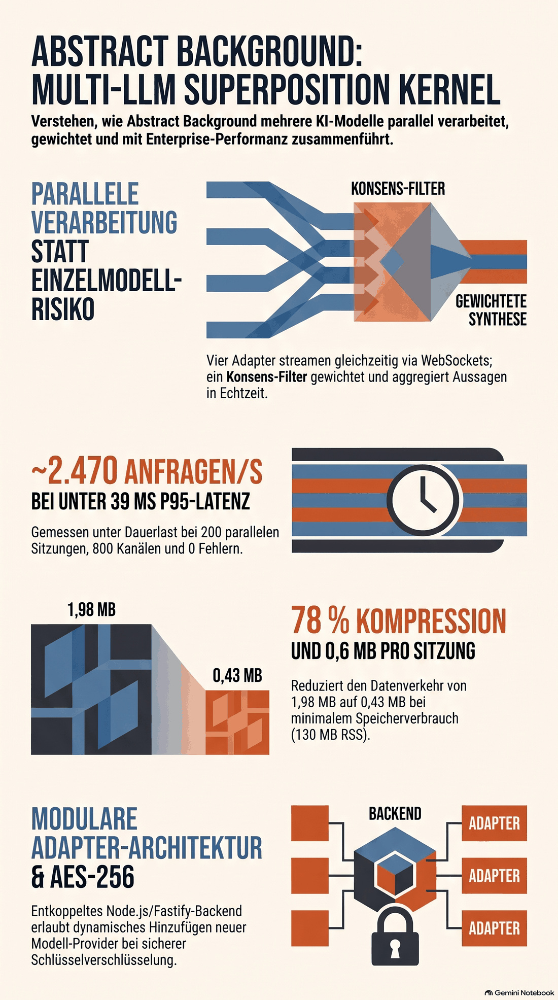

# Abstract Background

[English version](README.md)

**Live-Demo:** https://abstractbg-qehn8ouj.manus.space — ohne Anmeldung.

Prototyp einer Enterprise-Middleware für **AI-Superposition**. Eine Anfrage wird gleichzeitig an
mehrere Modelle gestellt, deren Antworten parallel einlaufen, einzeln gewichtet und über einen
visuellen Kollaps zu einem finalen Ergebnis zusammengeführt werden.

Grundlage: NotebookLM-Notebook „Abstract Background: AI Superposition Enterprise Middleware“.


## Funktionsumfang

- **Auftragskonsole** mit Adapterauswahl, Kollapsregel und Streuungsparameter
- **Superpositionsfeld**: je Modell eine Welle, Amplitude folgt dem Gewicht; die Summenkurve
  zeichnet das Kollapsergebnis vor
- **Vier Basiskänäle** (OpenAI, Anthropic, Mistral, Llama) plus eigene Adapter, mit tokenweise
  gestreamten Antworten, gemessener Laufzeit, Tokenzahl und Live-Status
- **Gewichtungsregler** je Modell mit unmittelbar sichtbarer Verteilung
- **Kollaps** in drei Phasen mit anschließendem Ergebnis, Kollaps-Protokoll, Konvergenz-Index,
  Modellgüte und Kohärenzanalyse zwischen allen Modellpaaren
- **Adapter-Verzeichnis**: neue Adapter zur Laufzeit anlegen, aktivieren, auswählen, entfernen
- **Sicherheitsstatus**: serverseitiger AES-256-GCM-Tresor, maskierte Vorschau und Fingerprint,
  keine Schlüssel im Frontend
- **Telemetrie** und Ereignisprotokoll in der linken Messleiste

## Architektur

| Schicht | Umsetzung |
| --- | --- |
| Frontend | React 18, TypeScript, Vite — Cyber-Minimalismus, deutsche Oberfläche |
| Backend | Node.js, Fastify auf Port 3000 (ein Prozess für API, Stream und Frontend) |
| Live-Kanal | WebSocket `/ws` mit automatischem Rückfall auf Server-Sent-Events |
| Nebenläufigkeit | Ereignispuffer je Sitzung — späte Empfänger erhalten zuerst den Verlauf |
| Adapter | modulare Registry mit Validierung und Persistenz in `.data/adapters.json` |
| Sicherheit | `server/crypto.mjs`: AES-256-GCM, Maskierung, Fingerprint |

Der Prototyp simuliert die Anbieterantworten serverseitig; Laufzeit, Tokenzahl und Streuung sind
gemessene Werte der Simulation. Die Adapter lassen sich später gegen echte Endpunkte tauschen,
ohne die Oberfläche zu ändern.

## Entwicklung

```sh
pnpm install
pnpm dev      # Vite im Middleware-Modus im Fastify-Prozess, Port 3000
pnpm check    # TypeScript ohne Ausgabe
pnpm build    # Produktionsbuild nach dist/
pnpm start    # Produktionsbetrieb, liefert dist/ statisch aus
```

## Schnittstellen

| Methode | Pfad | Zweck |
| --- | --- | --- |
| GET | `/api/health` | Bereitschaftsprüfung |
| GET | `/api/architecture` | Beschreibung des Stacks |
| GET | `/api/security` | Tresorstatus, Maskierung, Maßnahmen |
| GET | `/api/adapters` | alle Adapter |
| POST | `/api/adapters` | Adapter anlegen (validiert) |
| DELETE | `/api/adapters/:id` | eigenen Adapter entfernen |
| POST | `/api/superposition` | Sitzung starten, liefert `sessionId` und Kanalpfade |
| GET | `/api/stream/:id` | Server-Sent-Events-Kanal |
| GET | `/ws?session=…` | WebSocket-Kanal |
| GET | `/api/session/:id` | Zustand einer Sitzung |
| POST | `/api/collapse` | Kollaps mit Gewichten auslösen |
| GET | `/api/telemetry` | Momentaufnahme der Telemetrie |

## Veröffentlichung

Containerbetrieb über `Dockerfile` (Build-Stufe erzeugt `dist/`, Laufzeitstufe startet
`server/index.mjs`), Health-Pfad `/api/health`, Port 3000.
## Kollapsregeln

Der Kollaps verändert keine Einzelantwort. Er wählt aus, ordnet zu und protokolliert. Drei Regeln
stehen zur Wahl und wirken serverseitig:

| Regel | Wirkung |
| --- | --- |
| Gewichtete Synthese | Träger nach höchstem Anteil; Beiträge ab 15 % werden als Ergänzungen eingemischt, darunter als Randnotiz ausgewiesen |
| Bester Träger | Ausschließlich die Ausgabe mit dem höchsten Gewicht bildet das Ergebnis; alle übrigen Kanäle werden als nicht eingemischt kenntlich gemacht |
| Konsens erzwingen | Es tragen nur Sätze, die die Konsensschwelle gegenüber mindestens `minAgreeingModels` Modellen erreichen; die gemeinsame Begriffsbasis wird ausgewiesen, nicht gestützte Aussagen werden als Isolate verworfen |

Die **Streuung** moduliert zusätzlich den Zeitverlauf der Kanäle: höhere Werte erzeugen
unregelmäßigere Taktraten, niedrigere ein gleichmäßiges, vorhersehbares Streaming.

## Schlüsselablage

Zugangsschlüssel werden ausschließlich über `server/crypto.mjs` mit AES-256-GCM verschlüsselt
abgelegt. Nach außen geben die Schnittstellen nur maskierte Vorschau, Fingerprint und Verfahren an.
Endpunkt-URLs mit eingebetteten Zugangsdaten werden abgewiesen; der Schlüssel gehört in das dafür
vorgesehene Feld. Der Adapterkatalog enthält daher niemals Rohgeheimnisse.

## Grenzen des Prototyps

- Die Anbieterantworten sind serverseitige Simulationen mit gemessener Laufzeit und Tokenzahl;
  echte Anbieterendpunkte sind bewusst nicht angebunden.
- Sitzungen liegen im Arbeitsspeicher und laufen nach 20 Minuten ohne Zugriff ab.
- Der Adapterkatalog wird in `.data/adapters.json` gesichert. Im Container ist dieses Verzeichnis
  flüchtig; für einen Dauerbetrieb gehört die Registry in eine Datenbank.
- Die verändernden Schnittstellen (`POST/DELETE /api/adapters`, Start und Kollaps) lassen sich über
  `ABSTRACT_API_KEY` schützen (siehe Zugangskontrolle). Dieser Schlüssel ist ein gemeinsames
  Geheimnis, keine Benutzeridentität; echte Konten mit Rollen fehlen.
## Kohärenz und Konvergenz

`server/coherence.mjs` setzt die gelieferte Ausarbeitung zur Kollapslogik um (dort als TypeScript
skizziert, hier als ESM-Modul des Fastify-Prozesses, damit kein zusätzlicher Übersetzungsschritt
nötig ist). Die Namen der Vorlage bleiben erhalten: `calculateTextSimilarity`,
`buildCoherenceMatrix`, `executeSuperpositionCollapse`, `CollapseResult`.

1. **Normalisierung**: Die Gewichte der aktiven Kanäle werden auf die Summe 1 bezogen;
   bei Gesamtsumme 0 erhält jedes Modell den gleichen Anteil.
2. **Kohärenzmatrix**: Für jedes geordnete Modellpaar wird die lexikalische Ähnlichkeit als
   Jaccard-Koeffizient über die Wortmengen der beiden Ausgaben bestimmt. Der Vergleich eines
   Modells mit sich selbst ergibt 1.
3. **Konvergenz-Index**: Mittel über alle Werte außerhalb der Diagonalen, also die durchschnittliche
   paarweise Kohärenz. Hohe Werte bedeuten ähnliche Aussagen, niedrige Werte starke Streuung.
4. **Kollaps**: Das Modell mit dem höchsten normalisierten Gewicht trägt die Kernaussage; die
   gewählte Kollapsregel bestimmt, was zusätzlich einfließt.

Zusätzlich weist das Ergebnis die **Gewichtskonzentration** aus (Summe der quadrierten
Gewichtsanteile, 1 = ein einziger Träger) und die **Modellgüte** als gewichtetes Mittel der
Selbstbewertungen. Die vollständige Matrix wird im Ergebnisbereich als Heatmap dargestellt, die
größten Abweichungen zusätzlich als Liste.
## Lasttest

`scripts/loadtest.mjs` prüft Nebenläufigkeit, Latenz und Skalierung gegen eine laufende Instanz:

```sh
NODE_ENV=production PORT=3200 ABSTRACT_MAX_SESSIONS=200 node server/index.mjs &
pnpm loadtest --base=http://127.0.0.1:3200 --sessions=120 --combined-sessions=60
```

Der Lauf erzeugt Sitzungen, verbindet je Sitzung einen WebSocket-Client, prüft die Vollständigkeit
der Ereignispuffer über späte Zweitverbindungen, misst die Kollaps-Latenz im Ruhezustand und
während laufender Ströme, benchmarkt die Kohärenzmatrix über wachsende Modellzahlen und ermittelt
den Durchsatz einfacher HTTP-Endpunkte. Berichte landen in `reports/` als JSON und Markdown.

Messwerte und Auswertung: [Lasttestbericht](reports/LOADTEST.md). Kurzfassung — 200 gleichzeitige
Sitzungen mit 800 Kanälen und rund 75.000 Ereignissen ohne Kanalverlust, Kollaps-Latenz P95 unter
40 ms auch unter Last, rund 2.500 HTTP-Anfragen pro Sekunde, Speicherbedarf etwa 0,6 MB je
gehaltener Sitzung.

Die Obergrenze gleichzeitiger Sitzungen steuert `ABSTRACT_MAX_SESSIONS` (Standard 200). Ist sie
erreicht und keine Sitzung abgeschlossen, wird der neue Auftrag mit HTTP 429 abgelehnt, statt eine
laufende Sitzung zu verdrängen. Die Telemetrie weist RSS, Heap und gepufferte Ereignisse aus.
## Speicher- und Netzwerkgrenzen

### Ereignispuffer je Sitzung

Jede Sitzung hält ihren Verlauf, damit ein später hinzutretender Empfänger ihn nachgespielt bekommt.
Dieser Puffer ist doppelt gedeckelt:

| Umgebungsvariable | Standard | Wirkung |
| --- | --- | --- |
| `ABSTRACT_MAX_BUFFERED_EVENTS` | 1500 | Höchstzahl gepufferter Ereignisse je Sitzung |
| `ABSTRACT_MAX_BUFFERED_CHARS` | 400000 | Höchstumfang der gepufferten Nutzlast je Sitzung |
| `ABSTRACT_MAX_SESSIONS` | 200 | gleichzeitig gehaltene Sitzungen |

Bei Überschreitung wird der **älteste** Verlaufsteil verworfen. Die Kürzung wird gezählt und im
Snapshot als `truncated` mit `droppedEvents` gemeldet; die Oberfläche schreibt dazu einen Hinweis
ins Protokoll, die Messleiste weist gekürzte Verläufe und ausgelagerte Ereignisse aus. Ein später
Empfänger erhält damit nie ein unbemerkt unvollständiges Bild.

### Streaming-Transport

Der WebSocket-Kanal komprimiert Nutzlasten ab 256 Byte (`permessage-deflate`, Kontextübernahme
aktiv). `ABSTRACT_WS_DEFLATE=0` schaltet die Kompression ab, etwa für Vergleichsmessungen. Der
Rückfallweg über Server-Sent-Events bleibt unkomprimiert.

Gemessen bei 60 gleichzeitigen Sitzungen und identischem Ereignisumfang: 1,98 MB über die Leitung
ohne Kompression gegenüber 0,43 MB mit Kompression — rund 78 % weniger Datenverkehr, bei
unveränderter Latenz und etwa 0,35 MB zusätzlichem Speicherbedarf je Verbindung. Der
SSE-Rückfallweg bleibt davon unberührt; dort übernimmt ein vorgeschalteter Proxy die Kompression.
## Zugangskontrolle

Die verändernden Schnittstellen lassen sich mit einem Zugangsschlüssel schützen. Ohne gesetzten
Schlüssel bleibt alles offen — die Voreinstellung ändert also nichts am bisherigen Verhalten.

| Umgebungsvariable | Wirkung |
| --- | --- |
| `ABSTRACT_API_KEY` | nicht gesetzt: offen · gesetzt: schreibende Aufrufe verlangen diesen Schlüssel |

Geschützt sind:

- `POST /api/superposition` (Auftrag starten)
- `POST /api/collapse` (Kollaps auslösen)
- `POST`, `PATCH`, `DELETE /api/adapters` (Adapterverwaltung)

Offen bleiben alle lesenden Endpunkte, der Live-Kanal (`/ws`, `/api/stream/:id`), die Telemetrie
und die Oberfläche selbst. Eine geschützte Instanz bleibt damit vollständig ansehbar, ohne dass
jemand Fremdes Aufträge starten oder Adapter anlegen kann.

Der Nachweis wird im Kopf `X-Api-Key` oder als `Authorization: Bearer <Schlüssel>` übergeben und
in konstanter Zeit verglichen (`crypto.timingSafeEqual`). `GET /api/access` meldet, ob die Instanz
geschützt ist, und nennt die geschützten Pfade. In der Oberfläche erscheint bei geschützten
Instanzen ein Feld für den Schlüssel; er wird lokal im Browser hinterlegt und mit jedem Aufruf
mitgesendet.

```sh
ABSTRACT_API_KEY=<schlüssel> node server/index.mjs     # geschützte Instanz
curl -X POST localhost:3000/api/superposition \
  -H 'Content-Type: application/json' -H 'X-Api-Key: <schlüssel>' \
  -d '{"prompt":"Beispielanfrage an die Superposition"}'
```

Dieser Schlüssel ist ein gemeinsames Geheimnis für eine Instanz, keine Benutzeridentität. Für
echte Konten mit Rollen und nachvollziehbarer Zuordnung ist die Anmeldung über das Manus-Konto
(OAuth) vorgesehen; sie ist in diesem Prototyp noch nicht umgesetzt.
## Konsensfilterung

Der Kollaps bewertet nicht nur, wer etwas gesagt hat, sondern auch, wie stark eine Aussage im
Modellverbund verankert ist. Dafür läuft über alle Ausgaben eine satzweise Konsensprüfung
(`server/consensus.mjs`): Für jeden Satz wird die größte Jaccard-Ähnlichkeit zu den Sätzen der
anderen Modelle bestimmt. Erreicht sie die Schwelle, gilt das andere Modell als zustimmend.

| Einstellung | Bereich | Standard | Wirkung |
| --- | --- | --- | --- |
| `jaccardThreshold` | 0.05–0.50 | 0.10 | ab welcher Ähnlichkeit zwei Aussagen als übereinstimmend gelten |
| `minAgreeingModels` | 1–6 | 2 | so viele Modelle müssen eine Aussage mindestens stützen |

Aussagen unterhalb der Mindeststützung werden zu **Isolaten**: Sie tragen das Ergebnis nicht mehr,
werden aber vollständig protokolliert. Der Rang getragener Aussagen verbindet Modellgewicht und
Verankerung: `Score = Gewichtsanteil × (0,5 + 0,5 × Zustimmungsanteil)`. Beide Werte sind auch je
Kollapsaufruf überschreibbar — eine Ausgabe lässt sich also mit mehreren Schwellen prüfen, ohne die
Sitzung neu zu starten:

```sh
curl -X POST localhost:3000/api/collapse -H 'Content-Type: application/json' \
  -d '{"sessionId":"…","weights":{},"jaccardThreshold":0.25,"minAgreeingModels":3}'
```

### Gemessene Wirkung der Schwelle

An einer Sitzung mit vier Modellen und 41 erkannten Aussagen (simulierte Anbieterantworten):

| Schwelle | Mindeststützung | gestützte Aussagen | Isolate |
| --- | --- | --- | --- |
| 0.05 | 2 | 39 von 41 | 2 |
| 0.10 | 2 | 27 von 41 | 14 |
| 0.15 | 2 | 9 von 41 | 32 |
| 0.20 | 2 | 3 von 41 | 38 |
| 0.25 | 2 | 2 von 41 | 39 |
| 0.25 | 3 | 0 von 41 | 41 |
| 0.25 | 4 | 0 von 41 | 41 |

Bei 0.25 mit mindestens drei Modellen bleibt das Ergebnis also bewusst leer: keine Aussage ist so
breit verankert. Genau das ist die Aussage dieser Regel — und sie ist im Protokoll nachlesbar.

**Grenze:** Die Kurve ist an den simulierten Antworten gemessen. Deren Sätze sind formelhaft und
teilen viele Begriffe, deshalb liegen die Ähnlichkeiten hoch. Bei echten Modelltexten ist mit
niedrigeren Werten zu rechnen; die Schwelle ist dann neu zu kalibrieren.

## Nachweise

Zwei unabhängige Prüfungen liegen mit Rohdaten im Repository.

- **Blinder Drucktest** — [`reports/PRESSURE-TEST.md`](reports/PRESSURE-TEST.md): Kapazitätsgrenze
  (fail-closed HTTP 429), Kanaltreue später Empfänger, Eingabemißbrauch, Schreibschutz.
  Skripte: `scripts/pressure-blackbox.mjs`, `scripts/system-probe.mjs`, `scripts/verify-hardening.mjs`.
- **Arbitrierungs-Ablation** — [`evaluation/REPORT.md`](evaluation/REPORT.md): drei
  Arbitrierungs-Lanes (Kollaps des Systems, deterministische Regeln, unabhängiger LLM-Richter) über
  ein vorab registriertes Korpus aus 24 Fallen und vier echten Modellen aus drei Anbieterfamilien.
  Eingefrorene Kanalantworten und Prüfsummen liegen in `evaluation/frozen/`.
  Aufruf: `node evaluation/generate.mjs && node evaluation/run-lanes.mjs`.

Ergebnis, klar benannt: Die Ablation zeigt **keinen belegbaren Verbundvorteil** auf einem Korpus,
das die Kanäle fast allein lösen. Sie zeigt aber einen echten Fehler — der Satzfilter verwarf die
kurze `ANSWER:`-Zeile jeder Ausgabe, sodass der Kollaps die ähnlichste Prosa statt der Entscheidung
trug. Das ist behoben; der Kollaps weist seine Entscheidung aus und führt alle Antwortzeilen wörtlich
auf. Zahlen und offene Fragen stehen in den Berichten.

## Umgebungsvariablen

| Variable | Vorgabe | Zweck |
| --- | --- | --- |
| `PORT` | `3000` | Listener-Port |
| `ABSTRACT_MAX_SESSIONS` | `200` | Sitzungsobergrenze; Überlast wird mit HTTP 429 abgewiesen |
| `ABSTRACT_EVICTION_GRACE_MS` | `5000` | Schonfrist, bevor eine beendete Sitzung verdrängt wird |
| `ABSTRACT_MAX_BUFFERED_EVENTS` | `1500` | Puffergrenze je Sitzung (Ereignisse) |
| `ABSTRACT_MAX_BUFFERED_CHARS` | `400000` | Puffergrenze je Sitzung (Zeichen) |
| `ABSTRACT_API_KEY` | nicht gesetzt | schützt schreibende Endpunkte, wenn gesetzt |
| `ABSTRACT_ADAPTER_WRITES` | `locked` in Produktion | `key`, `open` oder `locked` für die Adapter-Registry |
| `ABSTRACT_WS_COMPRESSION` | `on` | permessage-deflate für WebSocket-Streams |
