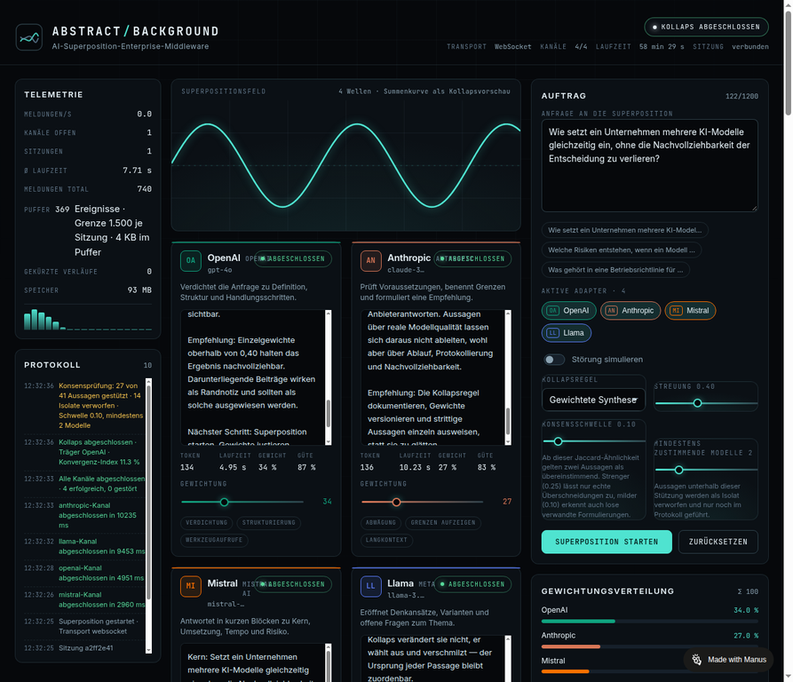
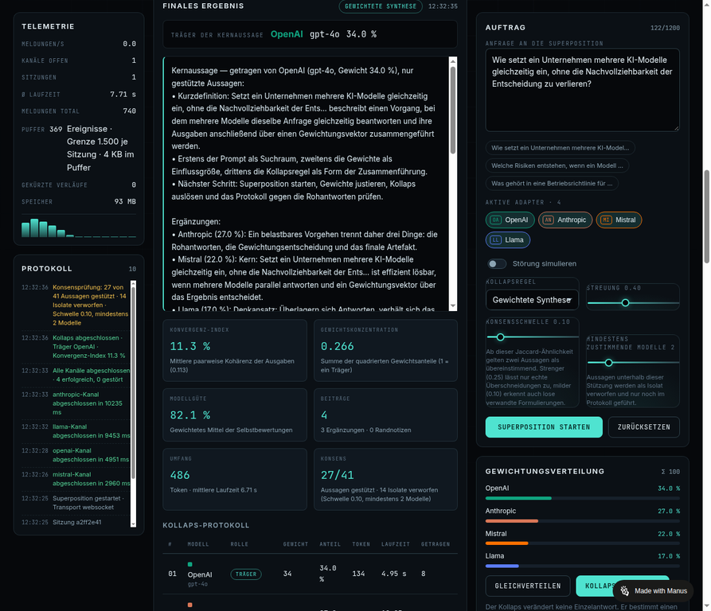
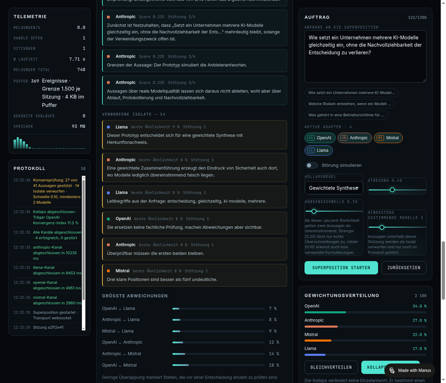

# Abstract Background

**Enterprise middleware for AI superposition.** One prompt goes to several models at once. Their
answers stream in parallel, are weighted individually, and collapse into a single result — with
every step logged and every sentence traceable back to the model that produced it.

**Live demo:** https://abstractbg-qehn8ouj.manus.space — no login required.

[Deutsche Fassung](README.de.md) · [Lasttest-Bericht](reports/LOADTEST.md)
[German overview graphic](docs/overview-de.png)


---

## Why

Asking one model gives you one answer and no way to see what it missed. Asking four models gives
you four answers and no way to combine them responsibly. This middleware does the combining part
properly:

- **Nothing is rewritten.** The collapse selects, ranks and attributes — it never edits a model's
  words. Every passage stays tied to its origin.
- **Agreement is measured, not assumed.** A sentence-level consensus check discards statements no
  other model supports instead of quietly blending them into the result.
- **Every decision is reproducible.** Weights, rule, thresholds, metrics and the full protocol are
  part of the result.

## Screenshots

| Live channels and telemetry | Collapsed result |
| --- | --- |
|  |  |

Consensus filtering — what carries the result and what was discarded:



## How it works

```
prompt ──┬──▶ OpenAI adapter    ─┐
         ├──▶ Anthropic adapter  │   streams (WebSocket / SSE)
         ├──▶ Mistral adapter    ├──▶ session hub ──▶ coherence + consensus
         └──▶ Llama adapter     ─┘        │
                                     weighted collapse ──▶ result + protocol
```

1. **Bundle.** The prompt is sent to every selected adapter. Each one streams its answer token by
   token over a live channel and reports runtime, token count and self-assessment.
2. **Fuse.** Weights are normalised, a full coherence matrix is built over all model pairs
   (Jaccard similarity of word sets), and the convergence index is derived from the pairwise means.
3. **Dissolve.** A collapse rule produces the final text; supporters, edge notes, divergences and
   the details of every step are recorded in the protocol.

### Collapse rules

| Rule | Behaviour |
| --- | --- |
| **Weighted synthesis** | Carrier statement plus additions by weight share; low-weight contributions stay marked as edge notes. |
| **Best carrier** | Only the strongest model's answer, untouched. Other channels are explicitly not mixed in. |
| **Consensus enforced** | Only statements supported by several models carry the result; unsupported ones become isolates. |

## Consensus filtering

Every sentence of every answer is checked against the sentences of all other models. If the
similarity reaches the threshold, that model counts as agreeing. Statements below the minimum
support become **isolates**: they no longer influence the result, but they are reported in full.

| Setting | Range | Default | Meaning |
| --- | --- | --- | --- |
| `jaccardThreshold` | 0.05–0.50 | `0.10` | similarity at which two statements count as agreeing |
| `minAgreeingModels` | 1–6 | `2` | how many models must support a statement |

Carried statements are ranked by `weight share × (0.5 + 0.5 × agreement share)`, so a widely
supported sentence from a light model can outrank an unsupported sentence from a heavy one.

Measured on one session with four models and 41 statements (simulated provider answers):

| Threshold | Min. support | Carried | Isolates |
| --- | --- | --- | --- |
| 0.05 | 2 | 39 / 41 | 2 |
| **0.10** | **2** | **27 / 41** | **14** |
| 0.15 | 2 | 9 / 41 | 32 |
| 0.25 | 2 | 2 / 41 | 39 |
| 0.25 | 3 | 0 / 41 | 41 |

At `0.25` with three agreeing models the result is deliberately empty: no statement is anchored
that broadly, and saying so is the honest output. Both settings can be overridden per collapse
call, so one session can be inspected under several thresholds.

## Transport and memory

- **WebSocket first** (`/ws`) with `permessage-deflate` above 256 bytes of payload, falling back to
  **Server-Sent Events** (`/api/stream/:id`) if the upgrade does not complete.
- **Replay buffer per session.** A late subscriber first receives the complete history, then the
  live stream — verified byte-identical in the load test.
- **Two hard caps per session**: `ABSTRACT_MAX_BUFFERED_EVENTS` (1500) and
  `ABSTRACT_MAX_BUFFERED_CHARS` (400 000). Beyond that the oldest part is dropped and the snapshot
  says so (`truncated`, `droppedEvents`) instead of silently serving an incomplete picture.
- **Capacity limit**: 200 concurrent sessions by default, configurable. New sessions are rejected
  with **HTTP 429** — running sessions are never evicted to make room.

## Measured behaviour

Full methodology and raw data: [reports/LOADTEST.md](reports/LOADTEST.md).

| Measure | Result |
| --- | --- |
| Concurrent sessions | 200 accepted (240 requested → 40 rejected with 429) |
| Parallel channels | 800 · 74 696 events · 0 disturbed channels |
| Collapse latency (P95) | 26.4 ms idle · 28.1–38.8 ms under permanent stream load |
| HTTP throughput | ~2 470 requests/s at concurrency 50, 0 errors |
| Coherence matrix | 4 models: 0.52 ms · 32: 2.60 ms · 256: 48.95 ms |
| Memory | ~0.6 MB per session, ~130 MB RSS at 200 sessions, no leak |
| Wire traffic | 1.98 MB → 0.43 MB with compression (**−78 %**, factor 4.6) |

## Security and operations

- **Server-side vault.** Provider keys are encrypted with AES-256-GCM and never reach the browser —
  only a masked preview and a ciphertext fingerprint are exposed.
- **Optional access key.** With `ABSTRACT_API_KEY` set, every mutating endpoint requires the key,
  compared in constant time (`timingSafeEqual`). Read paths and the UI stay open.
- **Fail-closed limits.** Capacity, buffer and payload limits reject rather than degrade silently.

## Quick start

```sh
pnpm install
pnpm dev                  # development on http://localhost:3000
```

Production:

```sh
pnpm build
pnpm start                # serves the built frontend and the API
```

Container:

```sh
docker build -t abstract-background .
docker run --rm -p 3000:3000 abstract-background
```

Checks and load test:

```sh
pnpm check                # TypeScript, no emit
pnpm loadtest             # needs a running instance, see scripts/loadtest.mjs
```

### Configuration

| Variable | Default | Effect |
| --- | --- | --- |
| `PORT` | `3000` | HTTP port |
| `NODE_ENV` | `development` | `production` serves the built frontend |
| `ABSTRACT_API_KEY` | – | enables write protection when set |
| `ABSTRACT_MAX_SESSIONS` | `200` | concurrent session limit |
| `ABSTRACT_MAX_BUFFERED_EVENTS` | `1500` | replay buffer per session, in events |
| `ABSTRACT_MAX_BUFFERED_CHARS` | `400000` | replay buffer per session, in characters |
| `ABSTRACT_WS_DEFLATE` | `1` | `0` disables WebSocket compression |
| `ABSTRACT_MASTER_KEY` | generated | master key for the demo vault |

## API

| Method | Path | Purpose |
| --- | --- | --- |
| `POST` | `/api/superposition` | start a session (prompt, adapters, rule, thresholds) |
| `POST` | `/api/collapse` | collapse a session (weights, optional threshold overrides) |
| `GET` | `/api/stream/:id` | Server-Sent Events stream of a session |
| `GET` | `/ws?session=…` | WebSocket stream of a session |
| `GET` | `/api/session/:id` | session snapshot incl. replay buffer state |
| `GET` | `/api/adapters` · `POST` · `DELETE /api/adapters/:id` | adapter registry |
| `GET` | `/api/telemetry` | sessions, throughput, buffer and memory metrics |
| `GET` | `/api/security` · `/api/architecture` · `/api/access` · `/api/health` | status endpoints |

## Project layout

```
server/          Fastify process
  index.mjs        routes, WebSocket and SSE, access guard
  hub.mjs          sessions, event buffer, capacity limit, telemetry
  providers.mjs    adapter definitions and persona templates
  adapters.mjs     registry with runtime persistence
  synthesis.mjs    collapse rules and protocol
  coherence.mjs    similarity, coherence matrix, convergence index
  consensus.mjs    sentence-level consensus and isolates
  crypto.mjs       AES-256-GCM vault
  access.mjs       API key check (constant time)
src/             React 18 + TypeScript interface
scripts/         load test
reports/         measured results
docs/            screenshots
```

## Honest limitations

This is a validated prototype, not a product. Specifically:

- **Provider answers are simulated.** The adapters generate measured streams server-side. The
  pipeline, logging and traceability are real; statements about actual model quality are not.
- **The consensus threshold is calibrated on simulated text**, whose sentences share many words.
  With real model output the values would be lower and the threshold would need re-measuring.
- **The vault is a demo.** No KMS, no rotation, no audit trail.
- **Single process, in-memory.** Sessions and buffers live in one Node.js process.
- **No user accounts.** Access control is one shared key, with no roles and no rate limiting.

## Roadmap

OAuth and real user roles · per-client rate limiting · multi-process or Redis-backed session store ·
real provider endpoints with streaming · worker threads for very large model sets.

## License

MIT — see [LICENSE](LICENSE).
